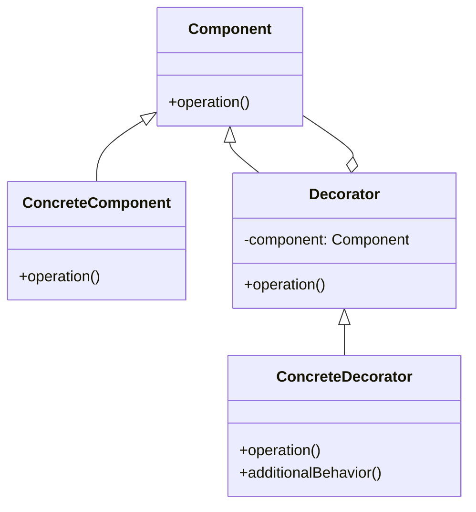

# Template for Python Design Pattern Documentation
This template is primarily focused on Python implementations of design patterns. While the design patterns are language-agnostic concepts, all examples, complexity ratings, and implementation details in this documentation are specifically tailored for Python developers.

This template includes sections for the pattern name, popularity, usage, complexity, intent, problem, solution, and real-world examples. Each section is clearly labeled and provides a description of what should be included. Sections should correspon to jupyter notebook cells

Popularity and complexity ratings should reflect the pattern's usage and difficulty level, respectively within Python programming language. Use the following scale for ratings:
- Popularity: ★☆☆☆☆ (rarely used) to ★★★★★ (very commonly used)
- Complexity: ★☆☆☆☆ (very simple) to ★★★★★ (very complex)

Diagram and example sections should demonstrate the pattern's structure and usage in Python, but should not be overly complex. The goal is to provide a clear and concise understanding of the pattern and its implementation in Python. Diagrams and example should implement same structure.

```markdown
## Pattern_name

- __Type:__ [Creational/Structural/Behavioral]
- __Popularity: ★★★★☆__
- __Complexity: ★☆☆☆☆__

### Intent:
__Pattern name__ is a [type] design pattern that [concise description of intent]. (Example: __Factory Method__ is a creational design pattern that provides an interface for creating objects in a superclass, but allows subclasses to alter the type of objects that will be created.)

### Problem:
Description of the problem that the pattern solves. This should be a clear and concise explanation of the issue at hand, including any relevant context or background information. Focus on:
- What specific design challenge does this pattern address?
- What would happen without this pattern?
- What constraints or requirements make this pattern necessary?

### Solution:
Description of the solution provided by the pattern. This should include a detailed explanation of how the pattern works. The solution should be clear and easy to understand, with a focus on how it addresses the problem described above. Include:
- The pattern's structure
- Key components and their roles
- How these components interact
- What benefits this structure provides
```

```markdown
### Diagram:
This section should include relevant diagrams using mermaid syntax to help illustrate the solution. Include:
- Class diagram showing the pattern structure
- Sequence diagram if applicable to show interaction flow
- Any other visual representation that helps explain the pattern

Example:


```python
### Example code:
# Provide a complete, working Python example that demonstrates the pattern
# Implement diagram provided above
# Include comments explaining key parts of the implementation
# Show how the pattern is used in context with sample usage code
# this example should be self-contained and runnable 
# if there is more common ways to implement this pattern in python please add more examples in separate code blocks with corresponding headings
```

```markdown
### Real-world analogies:
Real-world analogies that help to explain the pattern. This section should include examples from everyday life that relate to the pattern and help to clarify its purpose and function.

1. Example 1:

    Description of the example including how it maps to pattern components

2. Example 2:

    Description of the example including how it maps to pattern components
```

```markdown
### When to use:
- List specific scenarios or conditions where this pattern is particularly useful
- Mention any prerequisites that should be in place before applying this pattern
- Note any complementary patterns often used alongside this one
```

```markdown
### Python-specific implementation notes:
- Mention any Python-specific features or idioms that make this pattern implementation unique
- Discuss any Python libraries that provide built-in support for this pattern
- Highlight any differences between classical pattern implementation and Python's approach

### Related patterns:
- Pattern 1: Brief explanation of its relationship to the current pattern
- Pattern 2: Brief explanation of its relationship to the current pattern
```

